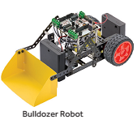
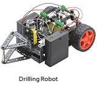
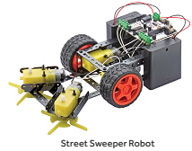
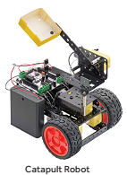
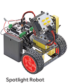
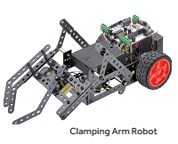
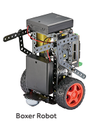
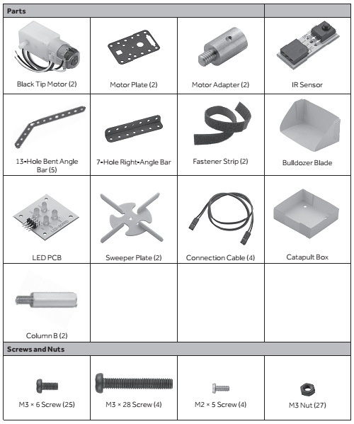

## Getting Started
Using parts from the Robotics Starter Kit and this Add-On Project Kit, you can build the following robots and program them using your Arduino Uno R3 (not included):
Surveillance Robot: Use the video function of your smartphone to peek into the next room.
-  Bulldozer Robot: Pick up and drop off small items. 

-  Drilling Robot: Drive around the room while you “bore” into things.

-  Street Sweeper Robot: Clear a path with two rotating sweeper plates.

-  Catapult Robot: Get it outta here! Position the robot and launch small objects. 

-  Spotlight Robot: Shed some light on the situation with and LED board that moves up, down, left, and right.

-  Clamping Arm Robot: Pick it up and set it down with this grabbing robot.

-  Boxer Robot: Move your opponent around the ring with powerful uppercuts. 

Note: For an enhanced experience, plug in the IR sensor included in this kit, and control your robots with your home remote control (not included) or the Robotics Remote Control (not included)

## Package Contents
This Robotics Add-On Project Kit requires parts from the Robotics Starter Kit. 

